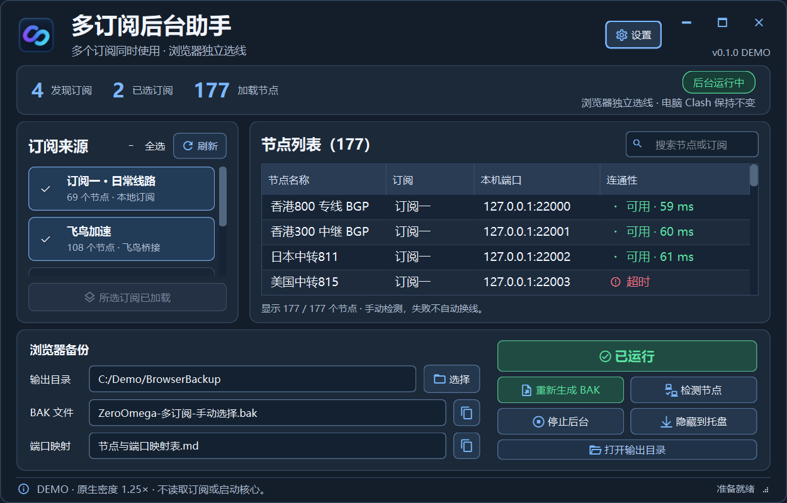

# 多订阅后台助手 · Multi Subscription Hub

Windows 上的独立浏览器代理后台：读取 Clash Verge Rev 已下载的多个订阅，为每个真实节点创建固定的本地 SOCKS5 入口，生成一份 ZeroOmega 备份。电脑的 Clash 默认线路和浏览器手动选择的线路可以同时不同。

**版本：2.0.0 · Windows x64 · 应用源码采用 MIT。**

[直接下载 EXE](https://github.com/Only-YingFeng/multi-subscription-hub/releases/latest/download/MultiSubscriptionHub.exe) · [完整包与版本说明](https://github.com/Only-YingFeng/multi-subscription-hub/releases/latest) · [使用说明](#使用流程) · [从源码运行与构建](#从源码运行与构建) · [许可与第三方声明](NOTICE.md)



*截图来自合成数据的原生窗口演示，标有 DEMO；节点、端口、可用数量与版本角标仅用于展示排版，不代表接收者的线路或当前联网结果。*

## 可以做什么

- 多个订阅同时供浏览器使用；不同浏览器在 ZeroOmega 中手动选择各自的具体节点。
- 每条节点一个本地 `127.0.0.1` SOCKS5 入口，尽量保留完整节点名；跨订阅同名时只添加必要区分。
- 使用独立 Mihomo 后台执行分流：直连规则直连、拦截规则拦截，代理请求走入口绑定的固定节点；未命中规则也使用这个节点代理。
- 保存稳定的端口登记。排序、唯一节点改名和认证轮换不重排已有端口；来源或线路身份改变时保守地分配新端口，旧端口不回收给另一条线路。
- 逐条低流量 HTTPS 连通性检测；不自动选优、负载均衡、换节点或失败直连。失效入口保留并拒绝代理请求。
- 生成本地地址和端口组成的 ZeroOmega `.bak`，不在插件内创建 PAC、Auto Switch 或 GFWList。
- 原生深色界面、托盘隐藏和后台状态管理。

**新版不需要写回 Clash 扩展。** 它运行自己的后台，不修改电脑原来的默认节点、系统代理、TUN、DNS、主路由或订阅原文。它也不是任意旧 `.bak` 的编辑合并器。

## 使用前准备

1. Windows x64；本次构建和源码环境为 CPython 3.13 x64。
2. 已安装并运行 Clash Verge Rev，已下载自己的有效订阅，主 Clash 使用规则模式。本版本以 Clash Verge Rev 2.5.7 / Mihomo 1.19.32 完成本机验证；其他版本或电脑尚未逐一验收。
3. 浏览器已安装 ZeroOmega。
4. 直接下载 `MultiSubscriptionHub.exe`，放在自己的可写文件夹中，双击即可运行，无需解压或安装 Python。完整 ZIP 是可选下载，包含对应源码和许可材料。

EXE 自带 Python / Qt 运行环境和第三方许可材料。应用自身 MIT 许可、对应源码及完整第三方说明同时保留在本仓库和完整 ZIP 中；修改或再分发时仍需遵守相关许可。

应用没有打包任何机场账号或代理核心。它会寻找正在运行的 `verge-mihomo.exe`，并私有复制所需核心；自动识别失败时，可在右上角“设置”指定 Clash 数据目录和标准 Mihomo 核心路径。已下载配置与 rule-provider 缓存仍来自自己的 Clash。

飞鸟桥接属于可选高级兼容功能，需要用户自己的完整兼容桥接目录与核心，并在“设置”指定路径。此公开包不提供它们，也不会从机场 EXE 自动提取账号。普通 Clash 订阅不需要飞鸟桥接。

## 使用流程

1. 在 Clash Verge Rev 中下载或更新订阅。
2. 打开 `MultiSubscriptionHub.exe`，自动读取本地数据；需要时点击“刷新”。
3. 勾选订阅，点击紫色 **“启动浏览器后台”**。成功后按钮变为绿色 **“已运行”**。已有后台时，修改勾选会显示 **“应用订阅选择”**；确认后只更新本软件后台。
4. 点击 **“检测节点”**，查看本次连通性结果。检测是推荐步骤，后台健康时也允许直接生成；失败节点仍会保留。
5. 点击 **“生成合并 BAK”**，得到 `ZeroOmega-多订阅-手动选择-独立分流.bak` 和节点与端口映射表。
6. 先在 ZeroOmega 备份原有选项，再通过 **“从备份文件恢复”** 导入新文件，手动选择具体节点。

使用独立节点时，**本软件后台需要持续运行**。可以“隐藏到托盘”；关闭主窗口会隐藏，托盘的“退出界面，后台继续运行”只退出管理界面。“停止后台”才停止自己的代理入口；此后选中这些入口的代理请求会失败。

没有自动安装系统服务、计划任务或开机启动。重启电脑后重新打开软件并启动后台。

## 订阅更新

**Clash 更新订阅 → 本软件刷新 → 勾选并应用订阅选择 → 检测节点 → 生成新 BAK → ZeroOmega 恢复。**

本软件的“刷新”不向机场请求更新，它读取 Clash 已下载的本地数据。浏览器选择另一订阅不要求电脑主 Clash 跟着切换。分流使用当前 Clash 生效规则的快照；主规则改变后，要刷新并重新应用。

不要删除 `private/` 来重置端口：该目录包含稳定身份、历史端口和私有恢复材料。移动软件目录前先停止后台，连同自己的 `private/` 完整搬移。核心版本发生变化时程序会明确停止自动替换，需先核验和备份再处理。

## 隐私与安全

公开 ZIP 与仓库不包含订阅、UUID、密码、控制密钥、真实节点映射、用户导出的 BAK 或私有测试日志。运行后 `private/` 保存本机敏感配置，权限限当前 Windows 用户与 SYSTEM，**请勿上传或分享该目录**。

BAK 包含节点显示名称与本地端口；即使没有认证信息，也应按自己的隐私偏好分享。软件不会直接修改浏览器登录数据库或扩展存储，导入由用户手动完成。

所有入口只监听回环地址，新的登记端口从 46000 起；不会占用旧单订阅工具的入口。仅停止能够核验完整进程身份的自有后台；已经运行的飞鸟桥接只借用，停止本软件不停止借用进程。

问题反馈请遵循 [SECURITY.md](SECURITY.md)，不要粘贴完整配置或订阅地址。

## 命令行

在解压目录打开 PowerShell：

```powershell
& .\MultiSubscriptionHub.exe --status --result-json .\后台状态.json
& .\MultiSubscriptionHub.exe --start --result-json .\启动结果.json
& .\MultiSubscriptionHub.exe --stop --result-json .\停止结果.json
& .\MultiSubscriptionHub.exe --export .\output --result-json .\导出结果.json
```

`--start` 启动上次已经准备好的配置，不更新订阅；首次使用和订阅更新建议通过 GUI。`--export` 要求最新准备的配置已运行且入口归属核验通过。GUI EXE 没有常驻终端窗口。

## 从源码运行与构建

在根目录使用 Python 3.13 x64：

```powershell
python -m venv .venv
.\.venv\Scripts\python.exe -m pip install -r requirements-build.txt
.\.venv\Scripts\python.exe -B app.py
```

构建 EXE：

```powershell
.\.venv\Scripts\python.exe -B build.py --output .\dist --work-dir .\build
```

构建目录必须在输出目录之外。该脚本只生成应用与第三方许可；完整公开发行包还应附带本仓库源码和根目录 LICENSE / NOTICE。本项目不需要 Node.js。

核心代码为 `backend.py`、`controller.py`、`view.py`、`app.py`；`qt_view.py` 提供复用的标题栏。`release_layout.py` 维护源码与许可文件白名单及许可材料哈希。修改/替换 LGPL 依赖时，应同步自己的清单与适用许可，而非覆盖正在运行版本的私有目录。

原单订阅工具的源码基线在 `original-source/`，来源见 [FORK_ORIGIN.md](FORK_ORIGIN.md)。原工具的“写回 Clash”流程与本软件的独立后台不同，开发新版不要把旧版当作运行入口。

## 测试与限制

可重现的合成测试命令见 [tests/README.md](tests/README.md)。本机原交付曾分别执行后台合约、桥接生命周期、控制器与 Qt 交互测试；公开版本的重跑结果见 [docs/validation.md](docs/validation.md)。它们不更新订阅，不改主 Clash。

支持内嵌节点和有安全本地缓存的 provider；缺少缓存会拒绝加载。链式节点、未知规则或混合规则目标需要明确核验，软件不会猜测。此版本范围为浏览器 TCP/HTTPS，未启用 UDP。

节点检测只代表当时测试目标的连通性，不保证所有网站或未来时间。发布上传验证、单元测试、原生 GUI 验收、真实浏览器导入和其他电脑验证分别是不同证据；本次没有代替用户在 ZeroOmega 中恢复备份，也没有宣称其他电脑已通过。

## 开源许可

应用自身代码采用 [MIT](LICENSE)，允许使用、修改、再分发及商用，保留许可和版权声明。第三方组件各自遵循原许可证；Qt / PySide / Shiboken 使用 LGPL 路径，完整材料和对应源码入口见 [NOTICE.md](NOTICE.md)。
