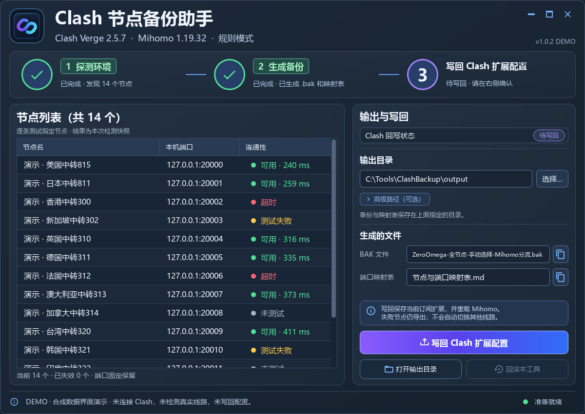

# Clash 节点备份助手 1.0.2

[直接下载 ClashZeroOmega.exe](https://github.com/Only-YingFeng/multi-subscription-hub/releases/latest/download/ClashZeroOmega.exe) · [源码](../original-source/) · [完整原版文档](../original-source/README.md)

这是先前开发的单订阅工具，并没有被多订阅后台助手替换或删除。它将 Clash Verge Rev **当前生效订阅**的全部真实节点转换为 ZeroOmega 中的本地 SOCKS5 情景模式，并通过订阅关联的持久扩展让主 Mihomo 为这些入口执行分流。



*使用原版实际 Qt 显示层与合成数据渲染的 DEMO；节点、延迟、路径及操作状态均为演示，没有连接或修改主 Clash。*

首次使用请看 [Clash Verge Rev + ZeroOmega 搭配教程](clash-zeroomega-guide.md)，包含官方插件地址、恢复 BAK 的步骤与菜单含义。

## 使用流程

1. 安装并运行自己的 Clash Verge Rev，更新或切换到需要使用的订阅，使用规则模式；浏览器安装 ZeroOmega。
2. 下载 EXE 放在自己的可写目录中，双击运行；Python、Node.js 与 Qt 环境已经打包。
3. 点击 **探测环境**，核验当前配置并检测各指定节点。
4. 点击 **生成备份**。如存在混合代理组或分流冲突，按界面提示明确选择规则动作。
5. 若显示 **待写回**，点击 **写回 Clash 扩展配置**，阅读短暂连接中断提示并确认。软件先私有备份、校验，再合并当前订阅持久扩展并热重载；已核验生效时不需要重复写回。
6. 在 ZeroOmega 先备份原有选项，再手动恢复生成的 `ZeroOmega-全节点-手动选择-Mihomo分流.bak`。

每个节点保留具体名称与固定端口。代理请求使用入口绑定的节点，直连和拦截规则保持；未命中规则使用该具体节点代理。失败节点不自动切换或回落直连。

**运行依赖是主 Clash。** 原版将入口应用到主 Clash，切换订阅可能改变这些入口的有效配置；若需要电脑使用订阅一、浏览器同时使用订阅二，选择 [多订阅后台助手](../README.md#多订阅后台助手-200-详细说明)。两个软件无需一起启动。

更新步骤：Clash 更新/切换订阅 → 原版探测 → 生成 → 需要时确认写回 → ZeroOmega 恢复新 BAK。默认节点选择与已有主配置设置保留；写回和回滚由用户明确确认。

## 隐私与兼容

原版默认私有状态在当前用户本地应用数据的 `CodexClashZeroOmega`，仅当前用户与 SYSTEM 可访问；不要分享、删除或与新版私有目录互相覆盖。它不修改浏览器登录数据库或运行中的扩展存储。卸除本工具管理的入口可用界面中的“回滚本工具”；这不会撤销手动恢复的 ZeroOmega 选项。

原交付验证的组合为 Windows x64、Clash Verge Rev 2.5.7、Mihomo 1.19.32、ZeroOmega 3.5.2 原生备份格式。当前版本对 provider、正则、复杂订阅扩展等明确停止并提示，其他版本和电脑尚未逐一验收。测试通过不保证用户的机场或未来节点可用性。

## 从源码运行与升级

在仓库根目录使用 Python 3.13 x64，开发时另需自己的可信 Node.js 25.2.1（EXE 用户不需要安装）：

```powershell
python -m venv .venv
.\.venv\Scripts\python.exe -m pip install -r original-source/requirements-build.txt
.\.venv\Scripts\python.exe -B original-source/app.py
.\.venv\Scripts\python.exe -B original-source/build.py --node "C:\Path\To\node.exe" --output .\dist-clash-original
```

构建参数与新软件不同：原版需要 `--node`。发布修改版时应附带对应源码、根目录 MIT 许可和完整第三方声明。完整许可与对应依赖源码入口见 [NOTICE](../NOTICE.md)。

合成测试在仓库根目录执行，Node.js 须位于 PATH：

```powershell
.\.venv\Scripts\python.exe -B original-source/tests/run-tests.py
.\.venv\Scripts\python.exe -B original-source/tests/qt-view-tests.py
.\.venv\Scripts\python.exe -B original-source/tests/qt-controller-tests.py
```

2026-10-07 本次公开补充重跑：5/5 离线测试组通过、28 项 Qt 显示层和 33 项 Qt 控制器测试通过；原版 EXE 自检确认 1.0.2、内置 Node.js 25.2.1、Qt、图标和资源就绪。未重载主 Clash，未替用户恢复 ZeroOmega。公开 EXE 的应用模块与仓库原版源码一致，未打包私有配置。

原版 EXE 的 SHA-256：

```
54f83bbf850657718590470a5849a07310c86c57869398e9322e594768a6888a
```
